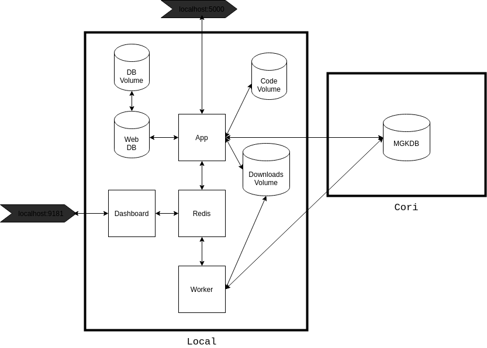
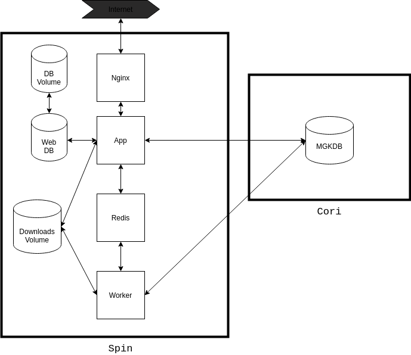

# MGKDB Web

The purpose of this web application is to provide easy access to data stored in the MGKDB database at NERSC. This includes searching for, viewing, and downloading complete outputs of gyrokinetic fusion simulations. In order to use the application, users must register for an account, verify their email, and wait for an administrator to approve their account request. Upon completion of the registration process, users can browse and download data. 

The download functionality is currently under construction as it is being ported to a Redis service to allow for background processes to handle long-running downloads.

Currently, in order for the web application to connect to the remote database, an ssh tunnel has to be established to bypass firewall restrictions. This requires a two-factor authentication procedure and thus limits the autonomy of the web application given that ssh tunnels are prone to be closed, requiring an administrator to reestablish the connection. An alternative solution should be developed, perhaps hosting the application on the same server could remedy the issue. 

## Application Structure/Functionality

This application is developed using the Flask framework utilizing a blueprint/app-factory structure. Currently there is only a single blueprint called ```main```.
Miguel Grinberg is the authoritative source on Flask development. Below are two useful resources for understanding the application structure.
    
- https://blog.miguelgrinberg.com/post/the-flask-mega-tutorial-part-i-hello-world
- https://g.co/kgs/3WTj27

Frontend styling is implemented with the Bootstrap framework and a little bit of Javascript is included for polling the database for updates, primarily for download progress.

The ```App/``` directory stores the main application code. The ```DB/``` directory stores the Dockerfile for the MySQL database that is used for storing user information and task requests. In order to start the database via ```docker-compose``` one needs to create a ```.env-mysql``` file to provide enviornment variables to the database. The ```Nginx/``` directory contains a Dockerfile for defining an Nginx image as well as a ```nginx.conf``` file for establishing the reverse-proxys ervice required for production. The Nginx configuration will likely require some tweaking to fit its eventual production environment.

User verification and approval is done through email and thus requires the confguration of an admin email account in the ```app/.env``` file. Downloads are meant to function as follows: A user requests a download, this action triggers an internal route in the ```app/main/views.py``` file, if the user has no other current task in progress, this route then spawns a task via the ```User.launch_task``` class method, this triggers the task to be sent to the redis queue, which then sends it to one of the possibly several available workers, the application then reports back on the download progress dynamically via a javascript function to poll the database, and once the download is completed, it sends a zip file to the client containing the data. In order for the app and worker containers to have access to the same downloads folder there is a downloads docker volume linked to both services in the docker-compose file.

## Development Instructions 

Some instructions for the development process.

To run the app in development navigate to the top level directory and run

```docker-compose up```

There is a docker volume linking the ```app/``` directory in the ```app``` container to the ```app/``` directory on the host machine, allowing for live reloading on code changes. 

In order for the App container to connect to the remote DB an ssh tunnel has to be established. Once the container is up, access it via

```docker exec -it app /bin/bash```

Map local port 27017 to remote db by running the following command

```ssh -4 -i .ssh/nersc -f \<your-nersc-username>@cori.nersc.gov -L 27017:mongodb03.nersc.gov:27017 -N````

See NERSC documentation for how to establish ssh tunnels if you encounter any issues. Ensure this is the port being used in the ```MONGO_URL``` variable stored in the ```.env``` file.

To access the MySQL DB inside the running docker container run the following

``` mysql -u username -p -h <container-ip> -P 3306 ```

You can get the docker container ip-address by running ```docker inspect db```.

## Development Architecture

All services are run via Docker and have their corresponding Dockerfiles in this repository. The main application is named app, MySQL is used as the database for the app with a volume to allow for persistence of data across restarts of the service, Redis is used as a task queue, and the app image is reused as the base image for Redis workers. Additionally, there is a dashboard service that can be used to monitor the progress of redis queue tasks for testing purposes. 



## Production Architecture

In production, the code volume is removed and instead the app image should be constructed by copying over the source code. The dashboard is also removed, although it could be included if desired. In both production and development, the main application is exposed to the user via a gunicorn web server. In production, an Nginx reverse-proxy should be configured for effecient routing and serving of static content. Additionally, a domain name should be routed to the appropriate url of the production deployment.

